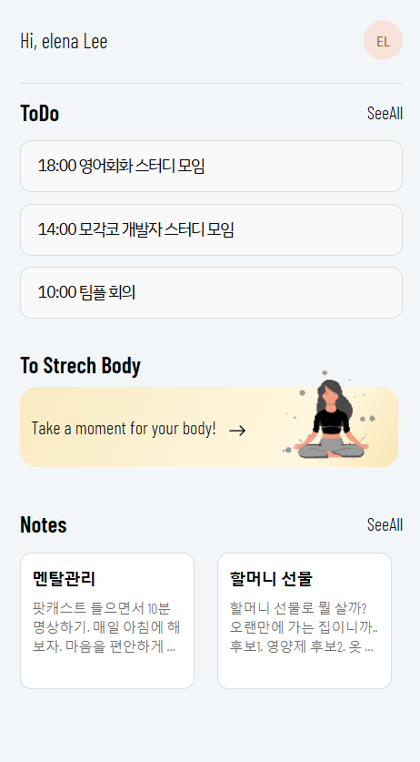
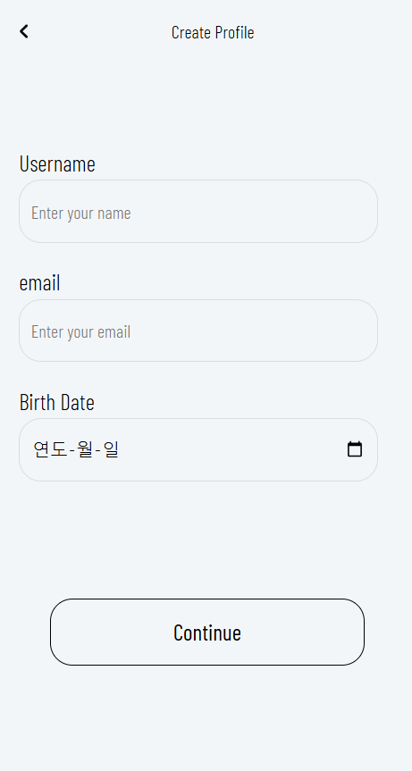
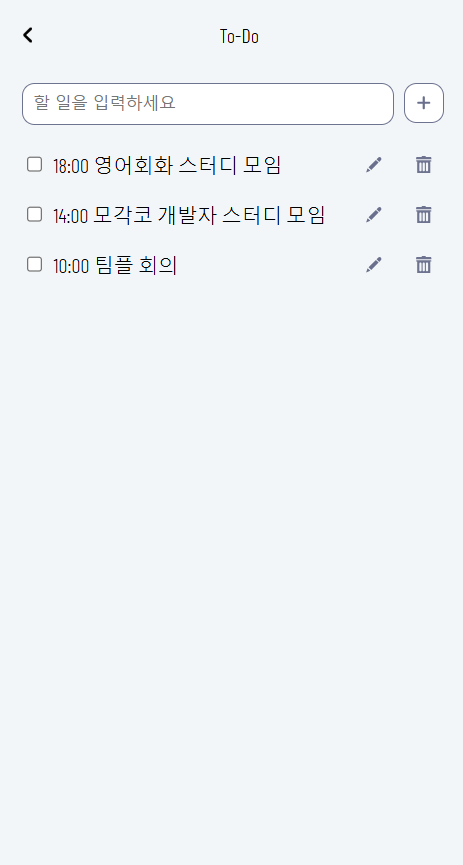
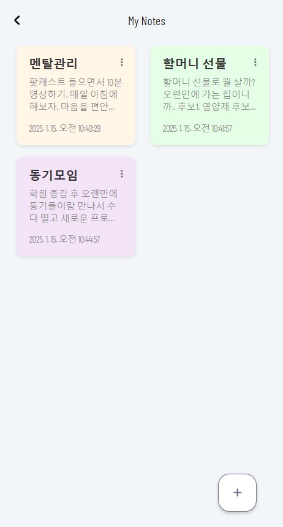
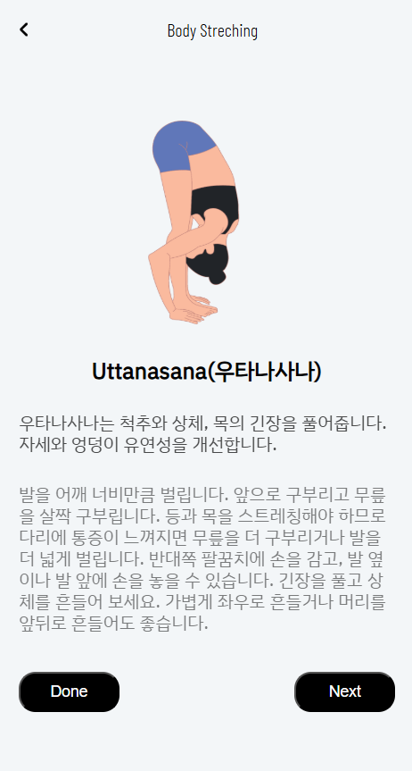

# 프로젝트명: Today, ON

### 투두리스트및 메모관리앱👀

### 배포주소

투데이온 바로가기: <https://elena7993.github.io/todayon/>

### 1. 앱 이미지

### 2.목적

- 투두리스트를 제공한다.
- 메모를 할 수 있는 노트를 제공한다.
- 간단한 스트레칭 가이드를 제공한다.

### 3.기능

- 할 일관리 : 입력한 작업은 리스트 형태로 저장됨
- 투두리스트와 노트 수정 및 삭제
- 데이터 유지: LocalStorage를 활용해 새로고침해도 저장된 할 일을 유지.
- 데이터를 불러와 랜덤하게 스트레칭 가이드 제공

### 4. 스택

- HTML, CSS, JavaScript, React, Figma

### 5. 개발 스케줄

| 날짜        | 작업 내용                                                          |
| ----------- | ------------------------------------------------------------------ |
| 토 30/11/24 | 아이디어어 선정 및 기획 확정 레퍼런스 조사 및 디자인 작업 시작  |
| 일 01/12/24 | 디자인 작업 완료 React 프로젝트 세팅, 홈화면과 메인화면 UI 구현 |
| 월 02/12/24 | To-Do List 구현                                                    |
| 화 03/12/24 | 스트레칭 리스트 구현 메모장 로직 구현                           |
| 수 04/12/24 | 각 페이지들 코드 최종 수정 유지보수 및 배포 준비                |
| 목 05/12/24 | 배포                                                               |
